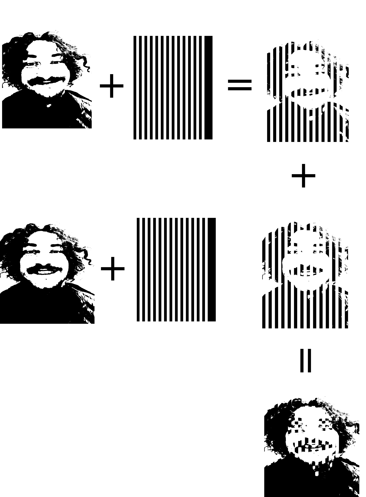

# Capture a smile on paper
Take a nice moment and have it printed on 
 paper to make it alive. 
  Impossible? -No! I will show you how:
 
This program uses Moiré interference to create a Moiré picture template. If you print the coresponding pattern on a transparent paper and slide it over it you have an animated version of your moment on paper!
  You only need:
* Your series of pictures
* A printer 
* A normal and transparent paper
* This program
* 
## Moiré effect- A Introduction
The Moiré effect is optical interference effect. Two or more overlapping grids interfere and create a interference pattern. 
An example is shown 
[here](https://en.wikipedia.org/wiki/File:Moir%C3%A9.gif). 

## How to do it
**Choose you files**
 
Take two or more pictures of you that you want to have in motion.  
**Use the code** 
Follow the program guide below to create the Moiré Template.   
**Print**  
You will find 3 files in the Output folder:
* moire.png : Your Moiré picture. Print it on normal paper!
* pattern.png The second grid. Print it on transparent paper! 
* animated-moire.gif: An animated preview of your result 
* reality.gif: This animated gif shows you how your resualt will look, if you have a changing angular mismatch- as it will always be in real life.

### How it works
The program does not use the classical Moiréeffect.
Each of your choosen pictures is multiplied by the inverse pattern template and then added to the final output image. This can be best seen below.

Each picture is stred on ths stips the template pattern hides all pictures except one. By sliding horizontally, you change the visible picture and you see motion -great!

### Remarks from science
 The spacial size of the interference pattern is bigger than the spatial pattern of the initial grids.  
A very interesting field of field of application is SIM (Structered ilummiation microscopy). The sample is illuminated 
with a specially designed (sinusoidal) grid. Due to the interference larger interference pattern will result. This can be 
measured and the originally (smaller) pattern can be recalculated. The world best microscopes use this trick!

# The Program guide

### Loading the data
Choose your png or jpeg files.   You don't have to preprocess the pictures, you will make them black and white during the process, but for the better results other programs like gimp, Adobe will result in greater results.
 
For the better flow, we recommend to take a video and extract 2 to 8 pictures for the best effect! This way it will look smooth!

### Saturation level
Get a preview of your binarized data and choose a threshold level. 
The higher the level the higher the contrast. Choose the advanced option for more exact adjusting. 
Press show to update the threshold-level.

### Stipe width
Choose the width of the stripes.  
A finer bining means more resolution, but may weaken the effect. The best is, if the change of your picture is within the size of a bin. It will look amazing then!
 
Play around and press show to see you updates.

### Gif animation 
The page will show you a preview of your data.  
Be patient the window with your gif will open in a couple of seconds!  
If you are happy press finish, otherwise back and choose other options for our perfect animation!
 
The button "reality simulation" will show another gif, that how the result will look like if you do not swipe perfectly horizontal.

### Advanced option
For all those:
* Angular mismatch for simulated reality gif
* Custum strip width
* Custum saturation
* rescle option for all images
   
Have fun

 
Marius Neugschwender